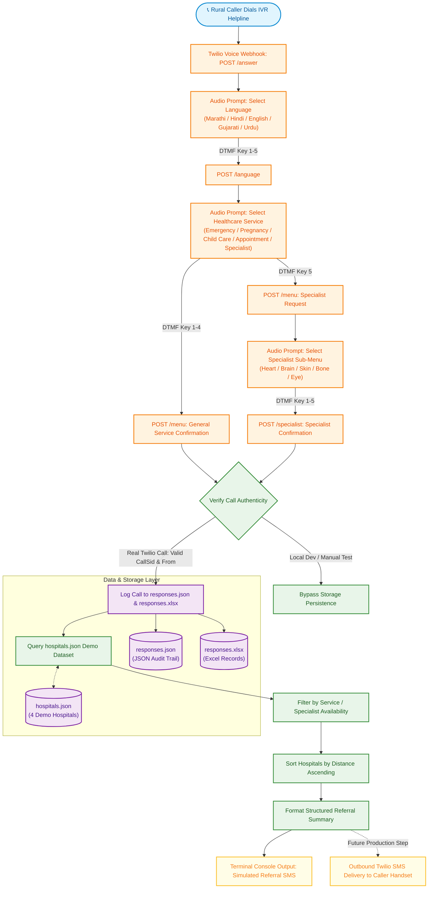

# Rural Healthcare Voice Navigation & Referral System

> *"Multiple platforms. Multiple services. One connected patient journey."*

[](https://www.sih.gov.in/)
[](https://www.sih.gov.in/)
[](https://www.sih.gov.in/)
[](https://www.python.org/)
[](https://palletsprojects.com/p/flask/)
[](https://www.twilio.com/)

---

## 📋 Project Identity & Metadata

| Attribute | Specification |
| :--- | :--- |
| **Project Name** | **Rural Healthcare Voice Navigation & Referral System** |
| **Tagline** | *"Multiple platforms. Multiple services. One connected patient journey."* |
| **Competition** | **Smart India Hackathon 2026** |
| **Problem Statement ID** | **SIH26133** |
| **Problem Statement** | *"Accessibility and quality of public healthcare services, particularly in rural and underserved areas"* |
| **Theme** | **MedTech / BioTech / HealthTech** |
| **Category** | **Software** |
| **Team Name** | **Team CamphorForge** |
| **Telephony Interface** | Interactive Voice Response (IVR) via Twilio Voice & TwiML |
| **Speech Engine** | Google Cloud WaveNet Neural Voices (Multilingual) |

---

## 💡 Core Project Philosophy: Orchestrating the Existing Healthcare Ecosystem

A common pitfall in digital health interventions is attempting to rebuild the entire public health stack from scratch. **This system does NOT attempt to recreate every existing government hospital, registry, or healthcare platform.**

Instead, it acts as a **voice-first healthcare navigation and referral orchestration layer** designed to connect rural citizens directly into existing public and private healthcare facilities.

```
       [ Rural / Underserved Citizen ]
                      │
                      ▼ (Standard Voice Call - Any Basic Phone)
┌───────────────────────────────────────────────────────────────┐
│     RURAL HEALTHCARE VOICE NAVIGATION & REFERRAL LAYER        │
│          "Orchestrating the Existing Healthcare Ecosystem"     │
└───────┬───────────────────────────────┬───────────────┬───────┘
        │                               │               │
        ▼                               ▼               ▼
┌──────────────────┐          ┌──────────────────┐  ┌──────────────────┐
│ Primary & Rural  │          │ District & State │  │ Specialist Care  │
│ Health Centres   │          │ Civil Hospitals  │  │ & Emergency Hubs │
└──────────────────┘          └──────────────────┘  └──────────────────┘
```

### The Primary Target User
This solution is purpose-built for citizens who face severe technological and geographical hurdles:
- **Basic Feature Phone Users:** Individuals reliant on 2G/keypad button phones with no touchscreens.
- **Zero Internet Requirement:** Requires **no data connection**, no smartphone apps, and no web browser.
- **Low Digital & Written Literacy:** Voice-prompted navigation requires no reading or typing skills.
- **Language Barriers:** Seamless guidance in native regional languages with natural human-sounding neural voices.
- **System Fragmentation:** Eliminates the confusion of finding which nearby facility has an active specialist, open pregnancy ward, or available appointment slot.

---

## ⚖️ Important Accuracy Rule: Prototype Status vs. Future Production Roadmap

To maintain strict scientific and engineering integrity, the table below explicitly delineates what is implemented in the **current working prototype** versus what is planned for **future production integration**.

| Dimension | Current Working Prototype (As Implemented) | Future / Production Integration Roadmap |
| :--- | :--- | :--- |
| **User Device** | Standard Voice Call via standard PSTN / Mobile network | Standard Voice Call via Toll-Free 1800 / Shortcode (e.g., 104) |
| **User Location** | **DEMO / SIMULATED Location** (`Coimbatore` demo sector) | Telecom Cell-Tower Triangulation / LBS / Caller PIN code prompt |
| **Facility Database** | **DEMO / SIMULATED Dataset** (4 demo hospitals in `hospitals.json`) | Real-time state health registry, Ayushman Bharat HPR, & PM-JAY database |
| **Facility Availability** | **Simulated timing & slots** defined in static demo dataset | Live hospital bed/doctor roster via National Health Authority (ABDM) APIs |
| **Referral Communication** | **GENERATED & LOGGED** to terminal console and local storage | **Automated Outbound SMS / WhatsApp** delivered directly to caller's handset |
| **Diagnosis & Clinical Advice**| **NO medical diagnosis or clinical advice** (Navigation only) | Triage prioritization & live call transfer to 108 / Tele-MANAS / eSanjeevani |
| **Storage Architecture** | Dual file-based persistence (`responses.json` & `responses.xlsx`) | High-concurrency encrypted PostgreSQL / ABDM FHIR Compliant Storage |

> [!IMPORTANT]
> **No Clinical Claims:** The prototype is an administrative navigation and referral routing interface. It does not provide medical diagnoses, prescribe treatments, or replace certified doctors, hospitals, or government emergency services.

---

## 🛑 The Problem

Accessing timely public healthcare in rural and underserved areas remains an uphill struggle due to structural systemic bottlenecks:

1. **Smartphone & App Dependency:** Most modern health-tech solutions assume smartphone ownership and active 4G/5G mobile data, excluding millions of rural households with basic button phones.
2. **Language Disconnect:** Centralized portals and apps often lack regional dialect nuance, making medical terms intimidating or inaccessible.
3. **Fragmented Healthcare Discoverability:** Patients often travel dozens of kilometers to a sub-centre only to discover that the specialist is unavailable on that day or that the facility lacks maternity infrastructure.
4. **Referral Ambiguity:** After realizing a medical need, rural patients frequently lack clear, actionable guidance on *where* to go, *who* is on duty, and *what* time consultation is offered.
5. **Digital Literacy Gaps:** Complex multi-step forms, logins, OTPs, and UI navigation prevent elderly and underserved populations from accessing digital healthcare services.

**Our Focus:** This project directly addresses the **Access, Triage, and Navigation Layer** by eliminating hardware, digital, and language prerequisites.

---

## ✅ The Solution

The system introduces a frictionless **Voice-First Navigation and Referral Pipeline**:

1. **Toll-Free Call Initiation:** The user dials the IVR phone number from any basic mobile phone or landline.
2. **Language Selection:** The caller is greeted and selects their preferred language from 5 regional languages.
3. **Service Categorization:** The caller selects the relevant healthcare stream using simple single-digit keypad presses.
4. **Specialist Selection (If Applicable):** For specialist consultations, the caller chooses the required medical specialty.
5. **Intelligent Facility Matching:** The system queries available facilities, verifies active operational hours, and identifies matching capabilities.
6. **Proximity Sorting:** Facilities are sorted dynamically from nearest to farthest relative to the caller's location.
7. **Referral Generation:** A concise, structured referral message containing hospital name, distance, and department timings is generated.
8. **Multi-Channel Delivery:** In the current prototype, the referral details are output to terminal logs and structured storage; in production, this is immediately dispatched to the caller via SMS.

---

## 🌐 Supported Languages

The IVR engine features native, high-fidelity neural speech synthesis powered by Google Cloud WaveNet voices tailored for Indian linguistic accents:

| Key | Language | Language Code | Neural Voice Model | Menu Prompt Sample |
| :---: | :--- | :---: | :--- | :--- |
| **1** | **Marathi** (मराठी) | `mr-IN` | `Google.mr-IN-Wavenet-A` | *"मराठीसाठी एक दाबा."* |
| **2** | **Hindi** (हिंदी) | `hi-IN` | `Google.hi-IN-Wavenet-A` | *"हिंदी के लिए दो दबाएं."* |
| **3** | **English** | `en-IN` | `Google.en-IN-Wavenet-A` | *"Press three for English."* |
| **4** | **Gujarati** (ગુજરાતી) | `gu-IN` | `Google.gu-IN-Wavenet-A` | *"ગુજરાતી માટે ચાર દબાવો."* |
| **5** | **Urdu** (اردو) | `ur-IN` | `Google.ur-IN-Wavenet-A` | *"اردو کے لیے پانچ دبائیں."* |

---

## 🏥 Healthcare Services Taxonomy

Callers can navigate five essential primary and tertiary healthcare categories:

```
                          [ Healthcare Services ]
                                     │
     ┌──────────────┬────────────────┼──────────────┬────────────────┐
     ▼              ▼                ▼              ▼                ▼
[1: Emergency] [2: Pregnancy]   [3: Child Care] [4: Appointment] [5: Specialist]
  24/7 Trauma    Maternity &      Pediatric &     Outpatient OPD    5 Department
  & Critical     Antenatal Care   Immunization    Time Slots        Sub-Menu
```

1. **`1` — Emergency:** Immediate critical and casualty services (24/7 trauma care routing).
2. **`2` — Pregnancy Care:** Antenatal checkups, delivery services, and maternal healthcare facilities.
3. **`3` — Child Care:** Pediatric clinics, newborn care, and child immunization support.
4. **`4` — Appointment Booking:** Outpatient Department (OPD) queue scheduling and slot selection.
5. **`5` — Specialist Consultation:** Direct routing to targeted medical disciplines.

---

## 🩺 Specialist Consultation Taxonomy

When **Option 5 (Specialist Consultation)** is selected, the caller enters a dedicated sub-menu offering five core clinical specialties:

| Key | Specialist Category | Internal Identifier | Clinical Coverage |
| :---: | :--- | :--- | :--- |
| **1** | **Heart Specialist** | `heart` | Cardiology, ECG, cardiac consultation |
| **2** | **Brain & Nerve Specialist** | `brain_nerve` | Neurology, neuro-consultation, nerve disorders |
| **3** | **Skin Specialist** | `skin` | Dermatology, skin infections, allergy management |
| **4** | **Bone & Joint Specialist** | `bone_joint` | Orthopedics, joint pain, fractures, bone health |
| **5** | **Eye Specialist** | `eye` | Ophthalmology, vision testing, cataracts, eye care |

---

## 🔄 End-to-End Workflow Diagram



---

## 🏛️ System Architecture & Technical Stack

The prototype leverages an asynchronous, event-driven web framework combined with telecom standard TwiML (Twilio Markup Language):

```
┌─────────────────────────────────────────────────────────────────────────┐
│                           APPLICATION STACK                             │
├──────────────────┬──────────────────────────────────────────────────────┤
│ Programming Lang │ Python 3.10+                                         │
│ Web Engine       │ Flask 3.1.3 (WSGI Web Server)                        │
│ Telephony Engine │ Twilio Voice SDK (VoiceResponse, Gather, Say, Pause) │
│ Speech Synthesis │ Google Cloud WaveNet Speech Engine via Twilio        │
│ Spreadsheet Sync │ openpyxl 3.1.5 (Workbook / Worksheet Management)     │
│ Local Tunneling  │ ngrok Secure Tunnel (Port 5000 -> Public HTTPS)     │
│ Configuration    │ python-dotenv (Environment Variable Isolation)       │
└──────────────────┴──────────────────────────────────────────────────────┘
```

### Key Engineering Features in `app.py`:
- **Audio Prosody Optimization (`say_loud`):** Uses custom SSML prosody configuration (`volume="x-loud"`) to guarantee crisp audibility over low-bandwidth 2G cellular connections.
- **Strict Webhook Authentication (`record_call_if_real`):** Prevents spam and mock testing data pollution by verifying that the request contains a legitimate Twilio `CallSid` (starting with `CA`) and valid caller number before saving to storage.
- **Fail-Safe Persistence:** Writes call audit records simultaneously to structured JSON (`responses.json`) and formatted Excel spreadsheet (`responses.xlsx`).
- **Resilient Hospital Matching Engine (`find_matching_hospitals`):** Parses nested hospital configurations, matches specialist sub-keys, and sorts results strictly by proximity in kilometers.

---

## 📁 Repository Structure

```
E:\healthcare_ivr\
│
├── app.py                 # Core Flask application, IVR routing, TwiML generation & storage logic
├── sms_service.py         # Referral SMS formatting module & Twilio Messaging Client wrapper
├── hospitals.json         # Simulated database containing 4 regional demo hospitals & schedules
├── responses.json         # Real-time JSON log of recorded genuine Twilio IVR calls
├── responses.xlsx         # Tabular Excel workbook logging call records with sequential IDs
├── requirements.txt       # Frozen Python dependencies and package versions
├── .env                   # Environment variables (Twilio credentials & phone numbers - gitignored)
├── .gitignore             # Git ignore definitions (protecting virtualenvs, credentials, and caches)
└── README.md              # Comprehensive project documentation
```

---

## 🏥 Simulated Healthcare Dataset (`hospitals.json`)

The prototype includes a calibrated demo dataset representing four healthcare facilities mapped across four sectors of the **Coimbatore Demo Zone**:

| ID | Facility Name | Demo Sector | Distance | Emergency | Maternity | Child Care | Specialist Specialties Available |
| :---: | :--- | :--- | :---: | :---: | :---: | :---: | :--- |
| **H001** | **Camphor Community Hospital** | Coimbatore North | **2.4 km** | ✅ 24/7 | ❌ | ✅ 8AM-8PM | Heart (10AM-1PM), Skin (2PM-5PM) |
| **H002** | **RuralCare Medical Centre** | Coimbatore East | **4.1 km** | ❌ | ✅ 24/7 | ✅ 9AM-5PM | Bone & Joint (11AM-3PM), Eye (9AM-1PM) |
| **H003** | **HealthBridge Hospital** | Coimbatore South | **6.3 km** | ✅ 24/7 | ✅ 8AM-6PM | ❌ | Heart (2PM-6PM), Brain & Nerve (10AM-2PM) |
| **H004** | **VillageCare Specialty Centre**| Coimbatore West | **8.0 km** | ✅ 24/7 | ❌ | ✅ 10AM-4PM | Skin (10AM-1PM), Bone & Joint (2PM-5PM), Eye (1PM-4PM) |

### Sample Generated Referral Output (Terminal Log)
When a caller selects **Specialist Consultation -> Heart Specialist**, the backend generates the following referral text:

```text
========================================
REFERRAL SMS GENERATED
========================================
To: +917904906221

Healthcare Referral - DEMO/SIMULATED

Heart Specialist:
1. Camphor Community Hospital - 2.4 km - 10:00 AM - 1:00 PM
2. HealthBridge Hospital - 6.3 km - 2:00 PM - 6:00 PM

Please visit a suitable hospital.
========================================
```

---

## 🚀 Setup & Execution Guide

### 1. Prerequisites
- Python 3.10 or higher installed.
- Active [Twilio Account](https://www.twilio.com/) with a Voice-enabled phone number.
- [ngrok](https://ngrok.com/) installed for local HTTPS webhook tunneling.

### 2. Environment Configuration
Create a `.env` file in the root directory:
```env
TWILIO_ACCOUNT_SID=your_twilio_account_sid_here
TWILIO_AUTH_TOKEN=your_twilio_auth_token_here
TWILIO_PHONE_NUMBER=your_twilio_phone_number_here
```

### 3. Installation
```powershell
# Navigate to the workspace directory
cd E:\healthcare_ivr

# Create and activate virtual environment
python -m venv venv
.\venv\Scripts\activate

# Install required dependencies
pip install -r requirements.txt
```

### 4. Running the Webhook Server
```powershell
python app.py
```
*The Flask development server will start on `http://127.0.0.1:5000`.*

### 5. Exposing via ngrok
In a separate terminal window:
```powershell
ngrok http 5000
```
Copy the generated public HTTPS URL (e.g., `https://your-domain.ngrok-free.dev`).

### 6. Twilio Console Webhook Setup
1. Log in to the **Twilio Console** and navigate to **Phone Numbers** -> **Manage** -> **Active Numbers**.
2. Select your active phone number.
3. Under the **Voice Configuration** section:
   - Set **"A CALL COMES IN"** to: `Webhook`
   - URL: `https://your-domain.ngrok-free.dev/answer`
   - HTTP Method: `HTTP POST`
4. Save the configuration and dial the phone number from any mobile or landline device.

---

## 👥 Team & Attribution

Developed with pride for **Smart India Hackathon 2026**:

* **Team Name:** CamphorForge
* **Theme:** MedTech / BioTech / HealthTech
* **Problem Statement:** SIH26133 — Accessibility and quality of public healthcare services in rural and underserved areas.

---

<div align="center">
  <sub>Built to empower rural citizens with voice-first, accessible, and connected healthcare navigation.</sub>
</div>